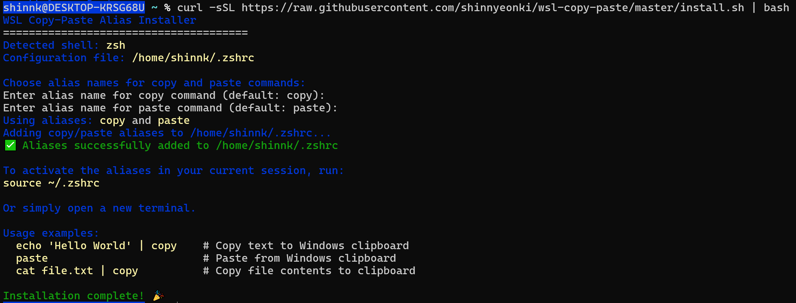

[ENGLISH](README.md)
[CHINA](README-zh.md)
[KOREAN](README-ko.md)
[JAPAN](README-ja.md)

### 概要

このドキュメントでは、WSL (Windows Subsystem for Linux) 環境で、macOSの `pbcopy` および `pbpaste` と完全に同じクリップボード機能を実現するために、`copy` と `paste` のエイリアス (alias) を設定する方法について説明します。

WSLのクリップボード問題を解決しようとする既存の多くのプロジェクトや記事がありますが、そのほとんどは次のような限界があります。

1.  **不十分な多言語サポート**: 単純に `clip.exe` を使用する方法では、エンコーディングの問題により、多言語環境で文字化けが発生しやすくなります。`cat sample.txt | clip.exe` コマンドの後に貼り付けを実行すると、文字列が文字化けして表示されます。
2.  **不要なプログラムのインストール**: 別途プログラムをインストールする必要がある解決策は、重すぎます。このガイドは、簡単なエイリアス設定だけで問題を解決します。
3.  **不完全な統合**: Windowsのクリップボードと完全に統合されておらず、クリップボードの履歴 (`Win + V`) に内容が正しく表示されないことがよくあります。
4.  **Windowsのデフォルトのテキスト処理方式を維持**: システムのデフォルト設定を変更する際に発生する可能性のある、他のソフトウェアでのテキストの文字化け現象を起こさずに、Windowsのネイティブなテキスト処理方式をそのまま使用します。
5.  **高速性**: https://github.com/memoryInject/wsl-clipboard のプロジェクトと比較して、機能はシンプルですが、速度が大幅に向上しています。

    ```shell
    shinnk@DESKTOP-KRSG68U:~/project/wsl-copy-paste$ time cat sample.txt | wcopy && time wpaste > /dev/
    null
    
    real    0m5.067s
    user    0m0.003s
    sys     0m0.000s
    
    real    0m5.069s
    user    0m0.003s
    sys     0m0.000s
    shinnk@DESKTOP-KRSG68U:~/project/wsl-copy-paste$ time cat sample.txt | copy && time paste > /dev/nu
    ll
    
    real    0m0.168s
    user    0m0.001s
    sys     0m0.003s
    
    real    0m0.225s
    user    0m0.001s
    sys     0m0.003s
    ```
### クイックインストール (推奨)

インストールスクリプトです。以下のコマンドをターミナルにコピーして実行してください。

```shell
curl -sSL https://raw.githubusercontent.com/shinnyeonki/wsl-copy-paste/master/install.sh | bash
```

インストール後、ターミナルを再起動するか、`source ~/.bashrc` (または `source ~/.zshrc`) を実行すると、すぐに `copy` と `paste` コマンドを使用できます。

削除またはエイリアスを再設定したい場合は、コマンドを再度実行してください。

### 手動インストール

単純なエイリアスなので、`.bashrc` または `.zshrc` ファイルの一番下に、次のコードを直接追加することもできます。

```shell
# .zshrc または .bashrc ファイルに追加
alias copy='powershell.exe -noprofile -command "$stdin = [Console]::OpenStandardInput(); $bytes = [System.IO.MemoryStream]::new(); $stdin.CopyTo($bytes); $text = [System.Text.Encoding]::UTF8.GetString($bytes.ToArray()); $text = $text -replace \"`n\", \"`r`n\"; Set-Clipboard -Value $text"'
alias paste='powershell.exe -noprofile -command "$text = Get-Clipboard -Raw; $bytes = [System.Text.Encoding]::UTF8.GetBytes($text); [Console]::OpenStandardOutput().Write($bytes, 0, $bytes.Length)" | tr -d "\r"'
```

ターミナルに変更を適用するには、`source ~/.bashrc` または `source ~/.zshrc` を実行するか、新しいターミナルを開きます。

### 将来の目標

> macOS システムで `man pbcopy` コマンドを入力した際に表示されるすべての機能を実装することが目標です。

**主な機能および考慮事項：**

- **ロケール（Locale）環境変数の参照：** `LANG=en_US.UTF-8` のようなロケール環境変数を参照し、入出力のエンコーディングを決定します。
- **処理可能なオブジェクト：**
  - [v] **プレインテキスト（Plain Text）：** 基本的なテキストのコピー・ペーストをサポートします。
  - [ ] **EPS（Encapsulated PostScript）：** 画像形式であるEPSデータを処理できるように実装する予定です。
  - [ ] **RTF（リッチテキストフォーマット）：** 書式付きテキストであるRTFデータを処理できるように実装する予定です。
- **開発形態：** 現在はエイリアス（alias）形式で開始していますが、将来的には通常のスクリプトファイルまたは実行可能ファイルに変更される可能性があります。
- **開発優先順位：** 処理量よりも反応性を優先して開発します。つまり、機能の即時応答性とユーザーエクスペリエンスを重視します。

### 中核原理: エンコーディングと改行問題を根本的に解決する方法

この方法が他の解決策と差別化される理由は、PowerShellの低レベルI/O機能を活用して、**エンコーディングと改行文字の問題を根本的に解決**するためです。

当初は、Windowsの `UTF-16 or CP949` とWSLの `UTF-8` 間の変換のために `iconv` のようなツールを使用するアプローチを検討しましたが、特定のユースケースで絵文字やタイ語など、特定の文字セットが文字化けするという限界がありました。これは、Windowsが使用する複雑なエンコーディング方式が原因です。現在、Windowsはレガシープログラムのためのコードページ (例: `CP949`) と、最新のシステムのための `UTF-16` を併用しています。

このガイドのアプローチは、この複雑な問題を直接扱うのではなく、**Windowsに組み込まれているAPI互換性レイヤー (API Thunking Layer) をそのまま活用**します。つまり、データのエンコーディングを無理に変換せず、データフローの両端で明示的に処理します。

*   **COPYプロセス (WSL → Windows)**: WSLからパイプで入力されたデータを、テキストではなく純粋な**バイトストリーム**として扱います。このバイトストリームをPowerShellで**明示的にUTF-8**として解釈し、Unicode文字列に変換した後、Windowsのクリップボードに保存します。
*   **PASTEプロセス (Windows → WSL)**: WindowsクリップボードのUnicodeテキストをPowerShellで**UTF-8バイトストリーム**に変換した後、WSLの標準出力に直接渡します。このプロセスは、途中でWindowsコンソールがテキストを誤って解釈し、エンコーディングを変更することを根本的に防ぎます。

この方式により、データ損失なく完全な文字列の互換性を保証します。

### 問題点: WSLとWindowsクリップボード間の非互換性

WindowsとLinux (WSL) は、テキストデータの処理方法に2つの大きな違いがあり、これが原因で、単純なクリップボード連携時にデータが破損する可能性があります。

1.  **改行文字 (Newline) の違い**:
    *   **Windows**: 一行の終わりを **CRLF** (`\r\n`, Carriage Return + Line Feed) で表します。
    *   **Linux/macOS**: **LF** (`\n`, Line Feed) のみを使用します。
    *   この違いにより、WSLからWindowsへ、またはその逆でテキストをコピーする際に、改行が崩れたり、`^M` のような不要な文字が挿入されたりすることがあります。

2.  **エンコーディングの違い**:
    *   WSLターミナル環境は、基本的に **UTF-8** エンコーディングを使用します。
    *   しかし、データが明示的なエンコーディングなしにパイプラインを通じてPowerShellに渡されると、システムのデフォルトエンコーディング (例: `UTF16`) で誤って解釈されます。
    *   これにより、ハングル、日本語、絵文字などのマルチバイト文字が文字化けして `???` や他の奇妙な文字で表示されます。

### コードの詳細説明

#### `copy` (WSL -> Windowsクリップボード)

`cat test.txt | copy` のように、パイプで入力されたデータをWindowsクリップボードにコピーします。

1.  `powershell.exe ...`: PowerShellスクリプトを実行します。
2.  `$stdin.CopyTo($bytes)`: WSLから受け取ったデータを、破損なくバイトストリームとして読み込みます。
3.  `[System.Text.Encoding]::UTF8.GetString(...)`: 読み込んだバイトストリームを**明示的にUTF-8**でデコードし、テキストに変換します。これが、多言語の文字が化けないようにする核心です。
4.  `Set-Clipboard -Value $text`: 最終的に変換されたテキストをWindowsクリップボードに保存します。

#### `paste` (Windowsクリップボード -> WSL)

Windowsクリップボードの内容をWSLターミナルに貼り付けます。

1.  `powershell.exe ...`: PowerShellスクリプトを実行します。
2.  `Get-Clipboard -Raw`: Windowsクリップボードからテキストデータを取得します。
3.  `[System.Text.Encoding]::UTF8.GetBytes($text)`: 取得したテキストを**明示的にUTF-8バイトストリーム**としてエンコードします。
4.  `[Console]::OpenStandardOutput().Write(...)`: エンコードされたバイトストリームをWSLの標準出力に直接書き込みます。
5.  `sed "s/\r$//"`: PowerShellが出力したデータの各行の末尾にある **CR** (`\r`) 文字を削除します。これにより、Windowsの **CRLF** をLinuxの **LF** に変換し、完全な互換性を保証します。

### テスト方法

#### TEST1
```shell
bash test.sh <INPUTFILE>
```
を実行し、copyを実行した結果のバイト配列が `unix2dos | iconv -f UTF-8 -t UTF-16LE` の結果と同一であることを確認するスクリプト。

#### TEST2

元のファイルのバイトシーケンスが、copyとpasteを経た後も、依然として同じバイトシーケンスを保持しているか？

```shell
echo "--- 元のファイル(sample.txt)のバイトシーケンス ---"
cat sample.txt | xxd
echo ""

cat sample.txt | copy

echo "--- クリップボード(paste)から取得したバイトシーケンス ---"
paste | xxd
echo ""

echo "--- 2つのバイトシーケンスの比較 (diffの結果) ---"
diff <(cat sample.txt | xxd) <(paste | xxd)

if [ $? -eq 0 ]; then
    echo "--> ✅ 2つのバイトシーケンスは完全に一致します。"
else
    echo "--> ❌ 2つのバイトシーケンス間に差異が発見されました。"
fi
```

### 期待される結果

テストスクリプトを実行したとき、`diff` コマンドは何も出力せず、最後に次のような成功メッセージが表示されるはずです。これは、元のデータとクリップボードを経たデータが100%同一であることを意味します。

```
--- 元のファイル(sample.txt)のバイトシーケンス ---
(ここにxxdの出力が表示されます)

--- クリップボード(paste)から取得したバイトシーケンス ---
(ここにxxdの出力が表示されます - 上記と同一であるべきです)

--- 2つのバイトシーケンスの比較 (diffの結果) ---

--> ✅ 2つのバイトシーケンスは完全に一致します。
```

### 追加事項
スクリプト内でこのコマンドを使用しようとすると問題が発生します。エイリアスの設定はインタラクティブモードでのみ機能するため、実行ファイルとして別途作成するか、`shopt -s expand_aliases` 設定を行う必要があります。