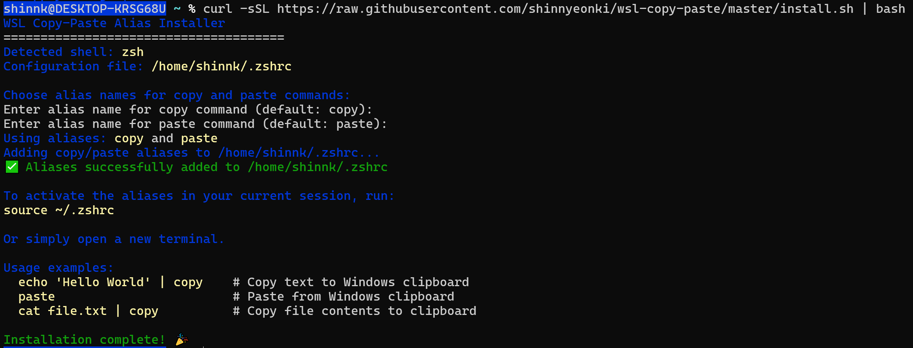

[ENGLISH](README.md)
[KOREAN](README-ko.md)

### 개요

이 문서는 WSL(Windows Subsystem for Linux) 환경에서 macOS의 `pbcopy` 및 `pbpaste`와 완벽하게 동일한 클립보드 기능을 구현하기 위해 `copy`와 `paste` alias(별칭)를 설정하는 방법을 설명합니다.

WSL의 클립보드 문제를 해결하려는 기존의 많은 프로젝트와 글이 있지만, 대부분 다음과 같은 한계가 있습니다.

1.  **부실한 다국어 지원**: `clip.exe`를 단순히 사용하는 방법은 인코딩 문제로 인해 다국어 환경에서 문자가 깨지기 쉽습니다. `cat sample.txt | clip.exe` 명령 이후 붙여넣기 실행시 문자열이 깨져서 나옵니다.
2.  **불필요한 프로그램 설치**: 별도의 프로그램을 설치해야 하는 해결책은 너무 무겁습니다. 이 가이드는 간단한 alias 설정만으로 문제를 해결합니다.
3.  **불완전한 통합**: Windows 클립보드와 완벽하게 통합되지 않아, 클립보드 히스토리(`Win + V`)에 내용이 제대로 나타나지 않는 경우가 많습니다. 
4.  **Windows 기본 텍스트 처리 방식 유지**: 시스템 기본 설정을 변경할 때 발생할 수 있는 다른 소프트웨어의 텍스트 깨짐 현상 없이, Windows의 네이티브 텍스트 처리 방식을 그대로 사용합니다.


### 빠른 설치 (권장)

설치 스크립트입니다. 아래 명령어를 터미널에 복사하여 실행하세요. (Bash, Zsh, Fish 지원)

```shell
curl -sSL https://raw.githubusercontent.com/shinnyeonki/wsl-copy-paste/master/install.sh | bash
```

설치 후 터미널을 다시 시작하거나 설정 파일을 로드(`source ~/.bashrc`, `source ~/.zshrc`, 또는 `source ~/.config/fish/config.fish`)하면 바로 `copy`와 `paste` 명령어를 사용할 수 있습니다.

삭제 또는 alias 를 재설정하고 싶다면 명령을 그대로 다시 실행하면 됩니다.

### 수동 설치

단순한 alias 이기 때문에 사용 중인 쉘 설정 파일의 맨 아래에 다음 코드를 직접 추가할 수 있습니다.

#### Bash / Zsh (`.bashrc` 또는 `.zshrc`)

```shell
# 1. Copy: Stdin(byte) -> MemoryStream -> UTF8 String -> Clipboard
alias copy='powershell.exe -noprofile -command "
  \$inputStream = [Console]::OpenStandardInput();
  \$memoryStream = New-Object System.IO.MemoryStream;
  \$inputStream.CopyTo(\$memoryStream);
  \$utf8Text = [System.Text.Encoding]::UTF8.GetString(\$memoryStream.ToArray());
  Set-Clipboard -Value \$utf8Text
"'

# 2. Paste: Clipboard -> UTF8 String -> UTF8 Bytes -> Stdout(byte)
alias paste='powershell.exe -noprofile -command "
  \$clipboardText = Get-Clipboard -Raw;
  if (\$clipboardText -ne \$null) {
    \$utf8Bytes = [System.Text.Encoding]::UTF8.GetBytes(\$clipboardText);
    \$outputStream = [Console]::OpenStandardOutput();
    \$outputStream.Write(\$utf8Bytes, 0, \$utf8Bytes.Length);
    \$outputStream.Flush();
    \$outputStream.Close();
  }
" | tr -d "\r"'
```

#### Fish (`~/.config/fish/config.fish`)

```fish
# 1. Copy
alias copy 'powershell.exe -noprofile -command "
  $inputStream = [Console]::OpenStandardInput();
  $memoryStream = New-Object System.IO.MemoryStream;
  $inputStream.CopyTo($memoryStream);
  $utf8Text = [System.Text.Encoding]::UTF8.GetString($memoryStream.ToArray());
  Set-Clipboard -Value $utf8Text
"'

# 2. Paste
alias paste 'powershell.exe -noprofile -command "
  $clipboardText = Get-Clipboard -Raw;
  if ($clipboardText -ne $null) {
    $utf8Bytes = [System.Text.Encoding]::UTF8.GetBytes($clipboardText);
    $outputStream = [Console]::OpenStandardOutput();
    $outputStream.Write($utf8Bytes, 0, $utf8Bytes.Length);
    $outputStream.Flush();
    $outputStream.Close();
  }
" | tr -d "\r"'
```

### Vim 통합 (Vim Integration)

Vim 내에서 시스템 클립보드(`copy`, `paste`)를 편리하게 사용하려면 `.vimrc` 파일에 다음 설정을 추가하세요.

```vim
" WSL 클립보드 통합 (copy/paste alias 활용)
vnoremap y :w !copy<CR><CR>
nnoremap p :read !paste<CR>
```

위 설정을 적용하면 Vim의 비주얼 모드에서 영역을 선택한 후 `y`를 누르면 윈도우 클립보드로 복사되고, 일반 모드에서 `p`를 누르면 클립보드 내용이 현재 줄 다음에 삽입됩니다.

> **주의**: alias는 Vim의 `system()`이나 `!` 명령에서 직접 인식되지 않을 수 있습니다. 이 경우 `install.sh`가 생성한 alias 대신 실제 명령어를 직접 매핑하거나, 쉘에서 alias가 확장되도록 설정해야 합니다. 더 안정적인 사용을 위해서는 `copy`/`paste`를 별도 실행 파일로 저장하여 `$PATH`에 두는 것을 권장합니다.

### 추후 목표

- 해당 도구를 wsl 내에서 실행되는 wayland 와 통합 처리 방법에 대해 고민하고 있습니다
- 윈도우 측의 여러가지 MINE type 들을 어떻게 처리할지 고민 중에 있습니다


### 핵심 원리: 인코딩과 개행 문제를 근본적으로 해결하는 방법

이 방법이 다른 해결책과 차별화되는 이유는 PowerShell의 저수준 I/O 기능을 활용하여 **인코딩과 개행 문자 문제를 근본적으로 해결**하기 때문입니다.

초기에는 윈도우 `UTF-16 or CP949` 와 WSL의 `UTF-8` 간 변환을 위해 `iconv` 같은 도구를 사용하는 접근법을 고려했으나, 특정 사용사례에서 이모지나 태국어 등 특정 문자 집합이 깨지는 한계가 있었습니다. 이는 Windows가 사용하는 복잡한 인코딩 방식 때문입니다. 현재 Windows는 레거시 프로그램을 위한 코드페이지(예: `CP949`)와 최신 시스템을 위한 `UTF-16`을 함께 사용합니다.

이 가이드의 접근법은 이 복잡한 문제를 직접 다루는 대신, **Windows의 내장 API 호환성 계층(API Thunking Layer)을 그대로 활용**합니다. 즉, 데이터의 인코딩을 억지로 변환하지 않고, 데이터 흐름의 양 끝단에서 명시적으로 처리합니다.

*   **COPY 과정 (WSL → Windows)**: WSL에서 파이프로 입력된 데이터를 텍스트가 아닌 순수한 **바이트 스트림**으로 취급합니다. 이 바이트 스트림을 PowerShell에서 **명시적으로 UTF-8**로 해석하여 유니코드 문자열로 변환한 뒤, Windows 클립보드에 저장합니다.
*   **PASTE 과정 (Windows → WSL)**: Windows 클립보드의 유니코드 텍스트를 PowerShell에서 **UTF-8 바이트 스트림**으로 변환한 후, WSL의 표준 출력으로 직접 전달합니다. 이 과정은 중간에 Windows 콘솔이 텍스트를 잘못 해석하여 인코딩을 변경하는 것을 원천적으로 방지합니다.

이러한 방식으로 데이터 손실 없이 완벽한 문자열 호환성을 보장합니다.

### 문제점: WSL과 Windows 클립보드 간의 비호환성

Windows와 Linux(WSL)는 텍스트 데이터를 처리하는 방식에 두 가지 큰 차이가 있으며, 이로 인해 단순한 클립보드 연동 시 데이터 손상이 발생할 수 있습니다.

1.  **개행 문자(Newline)의 차이**:
    *   **Windows**: 한 줄의 끝을 **CRLF**(`\r\n`, Carriage Return + Line Feed)로 표시합니다.
    *   **Linux/macOS**: **LF**(`\n`, Line Feed)만 사용합니다.
    *   이 차이 때문에 WSL에서 Windows로 또는 그 반대로 텍스트를 복사할 때 줄 바꿈이 깨지거나, `^M`과 같은 불필요한 문자가 삽입될 수 있습니다.

2.  **인코딩의 차이**:
    *   WSL 터미널 환경은 기본적으로 **UTF-8** 인코딩을 사용합니다.
    *   그러나 데이터가 명시적인 인코딩 없이 파이프라인을 통해 PowerShell로 전달되면, 시스템의 기본 인코딩(예: `UTF16`)으로 잘못 해석됩니다.
    *   이로 인해 한글, 일본어, 이모티콘과 같은 멀티바이트 문자가 깨져서 `???`나 다른 이상한 문자로 표시됩니다.


### 상세 설명

#### `copy` (WSL -> Windows 클립보드)

`cat test.txt | copy`와 같이 파이프로 입력된 데이터를 Windows 클립보드로 복사합니다.

1.  `powershell.exe ...`: PowerShell 스크립트를 실행합니다.
2.  `$inputStream = [Console]::OpenStandardInput()`: WSL로부터 데이터를 바이트 스트림으로 읽기 위해 표준 입력을 엽니다.
3.  `$memoryStream.CopyTo(...)`: 입력된 데이터를 손상 없이 메모리 스트림으로 복사합니다.
4.  `[System.Text.Encoding]::UTF8.GetString(...)`: 메모리 스트림에 저장된 바이트 배열을 **명시적으로 UTF-8**로 디코딩하여 텍스트로 변환합니다. 이것이 다국어 문자가 깨지지 않게 하는 핵심입니다.
5.  `Set-Clipboard -Value $utf8Text`: 최종 변환된 텍스트를 Windows 클립보드에 저장합니다.

#### `paste` (Windows 클립보드 -> WSL)

Windows 클립보드의 내용을 WSL 터미널로 붙여넣습니다.

1.  `powershell.exe ...`: PowerShell 스크립트를 실행합니다.
2.  `Get-Clipboard -Raw`: Windows 클립보드에서 가공되지 않은(Raw) 텍스트 데이터를 가져옵니다.
3.  `if ($clipboardText -ne $null)`: 클립보드가 비어있는지 확인합니다.
4.  `[System.Text.Encoding]::UTF8.GetBytes(...)`: 가져온 텍스트를 **명시적으로 UTF-8 바이트 스트림**으로 인코딩합니다.
5.  `$outputStream.Write(...)`: 인코딩된 바이트 스트림을 WSL의 표준 출력으로 직접 씁니다.
6.  `tr -d "\r"`: 출력된 데이터에서 **CR**(`\r`) 문자를 제거합니다. 이를 통해 Windows의 **CRLF**를 Linux의 **LF**로 변환하여 완벽한 호환성을 보장합니다.

### 테스트 방법

#### TEST1
```shell
bash test.sh <INPUTFILE>
```
을 실행하여 `copy`를 실행한 결과의 바이트 배열이 `unix2dos | iconv -f UTF-8 -t UTF-16LE` 결과와 동일한지 확인하는 스크립트입니다.

#### TEST2

원본 파일의 바이트 시퀀스가 `copy`와 `paste`를 거친 후에도 여전히 동일한 바이트 시퀀스를 가지고 있는가?

```shell
echo "--- 원본 파일(sample.txt)의 바이트 시퀀스 ---"
cat sample.txt | xxd
echo ""

cat sample.txt | copy

echo "--- 클립보드(paste)로부터 얻은 바이트 시퀀스 ---"
paste | xxd
echo ""

echo "--- 두 바이트 시퀀스 비교 (diff 결과) ---"
diff <(cat sample.txt | xxd) <(paste | xxd)

if [ $? -eq 0 ]; then
    echo "--> ✅ 두 바이트 시퀀스가 완벽하게 일치합니다."
else
    echo "--> ❌ 두 바이트 시퀀스 간에 차이가 발견되었습니다."
fi
```

### 예상 결과

테스트 스크립트를 실행했을 때, `diff` 명령어는 아무런 출력을 내지 않아야 하며, 마지막에 다음과 같은 성공 메시지가 보여야 합니다. 이는 원본 데이터와 클립보드를 거친 데이터가 100% 동일하다는 것을 의미합니다.

```
--- 원본 파일(sample.txt)의 바이트 시퀀스 ---
(xxd 출력이 여기에 나타남)

--- 클립보드(paste)로부터 얻은 바이트 시퀀스 ---
(xxd 출력이 여기에 나타남 - 위와 동일해야 함)

--- 두 바이트 시퀀스 비교 (diff 결과) ---

--> ✅ 두 바이트 시퀀스가 완벽하게 일치합니다.
```


### 추가사항
스크립트 내에서 해당 명령을 사용하려고 할 때 발생하는 문제입니다. alias 설정의 경우 interactive 모드에서만 작동하므로 실행파일로 따로 빼거나 `shopt -s expand_aliases` 설정을 해야 합니다.


