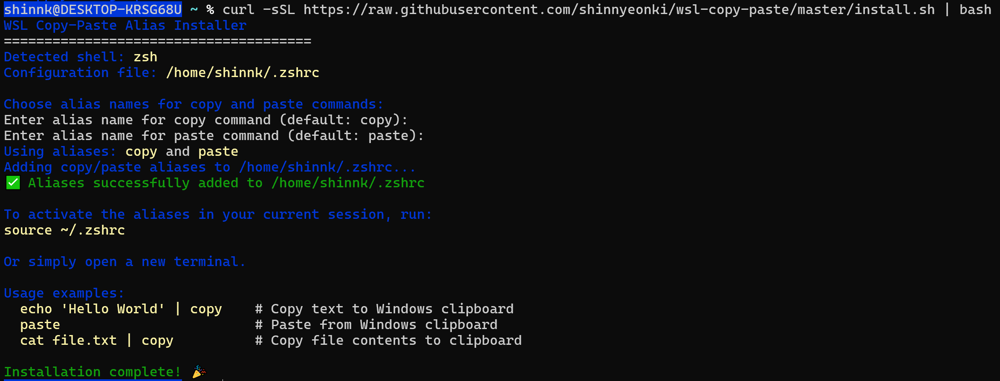

[ENGLISH](README.md)
[CHINA](README-zh.md)
[KOREAN](README-ko.md)
[JAPAN](README-ja.md)

### 概述

本文档介绍了如何在 WSL (Windows Subsystem for Linux) 环境中设置 `copy` 和 `paste` 别名 (alias)，以实现与 macOS 的 `pbcopy` 和 `pbpaste` 完全相同的剪贴板功能。

尽管已有很多项目和文章尝试解决 WSL 的剪贴板问题，但它们大多存在以下局限性：

1.  **多语言支持不佳**：简单使用 `clip.exe` 的方法因编码问题，在多语言环境下容易出现字符乱码。执行 `cat sample.txt | clip.exe` 命令后，粘贴出来的字符串会出现乱码。
2.  **不必要的程序安装**：需要安装额外程序的解决方案过于笨重。本指南仅通过简单的别名设置即可解决问题。
3.  **不完全的集成**：与 Windows 剪贴板未能完美集成，导致内容常常无法正常显示在剪贴板历史记录 (`Win + V`) 中。
4.  **保持 Windows 默认文本处理方式**：直接使用 Windows 的原生文本处理方式，避免了因更改系统默认设置而可能导致的其他软件文本乱码问题。


### 快速安装（推荐）

这是安装脚本。请将以下命令复制到终端并执行。

```shell
curl -sSL https://raw.githubusercontent.com/shinnyeonki/wsl-copy-paste/master/install.sh | bash
```

安装后，重启终端或执行 `source ~/.bashrc` (或 `source ~/.zshrc`)，即可立即使用 `copy` 和 `paste` 命令。

如果想要删除或重置别名，只需再次执行相同的命令即可。

### 手动安装

由于这只是一个简单的别名，您可以将以下代码直接添加到 `.bashrc` 或 `.zshrc` 文件的末尾：

```shell
# 添加到 .zshrc 或 .bashrc 文件
alias copy='powershell.exe -noprofile -command "$stdin = [Console]::OpenStandardInput(); $bytes = [System.IO.MemoryStream]::new(); $stdin.CopyTo($bytes); $text = [System.Text.Encoding]::UTF8.GetString($bytes.ToArray()); $text = $text -replace \"`n\", \"`r`n\"; Set-Clipboard -Value $text"'
alias paste='powershell.exe -noprofile -command "$text = Get-Clipboard -Raw; $bytes = [System.Text.Encoding]::UTF8.GetBytes($text); [Console]::OpenStandardOutput().Write($bytes, 0, $bytes.Length)" | tr -d "\r"'
```

要使更改在终端中生效，请执行 `source ~/.bashrc` 或 `source ~/.zshrc`，或者打开一个新的终端。

### 未来目标

> 目标是完整实现 macOS 系统中执行 `man pbcopy` 命令时所包含的全部功能。

**主要功能与注意事项：**

- **区域设置（Locale）环境变量参考：** 将参考如 `LANG=en_US.UTF-8` 等区域设置环境变量，以确定输入和输出的编码方式。
- **支持处理的对象：**
  - [v] **纯文本（Plain Text）：** 支持基本的文本复制与粘贴功能。
  - [ ] **EPS（封装式 PostScript）：** 计划实现对 EPS 图像数据的处理。
  - [ ] **RTF（富文本格式）：** 计划实现对带格式文本（RTF 数据）的处理。
- **开发形式：** 目前以别名（alias）形式开始开发，但未来可能会转变为普通脚本文件或可执行文件。
- **开发优先级：** 优先考虑响应速度而非处理吞吐量，即更重视功能的即时响应性和用户体验。

### 核心原理：从根本上解决编码和换行符问题的方法

此方法与其他解决方案的区别在于，它利用 PowerShell 的底层 I/O 功能，**从根本上解决了编码和换行符问题**。

最初，我们曾考虑使用 `iconv` 等工具来处理 Windows 的 `UTF-16 或 CP949` 与 WSL 的 `UTF-8` 之间的转换，但在特定用例中，这种方法在处理表情符号或泰语等特定字符集时存在乱码的局限。这是由于 Windows 使用了复杂的编码方式。目前，Windows 同时为旧版程序使用代码页 (例如 `CP949`)，并为现代系统使用 `UTF-16`。

本指南的方法并非直接处理这个复杂问题，而是**直接利用 Windows 内置的 API 兼容层 (API Thunking Layer)**。也就是说，不强制转换数据的编码，而是在数据流的两端进行显式处理。

*   **COPY 过程 (WSL → Windows)**：将从 WSL 管道输入的数据视为纯粹的**字节流**，而非文本。在 PowerShell 中，将此字节流**明确地以 UTF-8** 解码为 Unicode 字符串，然后存入 Windows 剪贴板。
*   **PASTE 过程 (Windows → WSL)**：在 PowerShell 中，将 Windows 剪贴板中的 Unicode 文本转换为 **UTF-8 字节流**，然后直接传递给 WSL 的标准输出。此过程从源头上防止了因 Windows 控制台错误解释文本而导致编码被更改的问题。

通过这种方式，可以保证完美的字符串兼容性，而不会造成数据丢失。

### 问题：WSL 与 Windows 剪贴板之间的不兼容性

Windows 和 Linux (WSL) 在处理文本数据的方式上存在两大差异，这导致简单的剪贴板交互可能会损坏数据。

1.  **换行符 (Newline) 的差异**：
    *   **Windows**：使用 **CRLF** (`\r\n`, Carriage Return + Line Feed) 表示一行的结束。
    *   **Linux/macOS**：仅使用 **LF** (`\n`, Line Feed)。
    *   由于这种差异，在 WSL 和 Windows 之间复制文本时，换行可能会被破坏，或者出现像 `^M` 这样不必要的字符。

2.  **编码的差异**：
    *   WSL 终端环境默认使用 **UTF-8** 编码。
    *   但是，当数据在没有明确指定编码的情况下通过管道传递给 PowerShell 时，可能会被错误地解释为系统默认编码 (例如 `UTF16`)。
    *   这导致韩文、日文、表情符号等多字节字符出现乱码，显示为 `???` 或其他异常字符。

### 代码详解

#### `copy` (WSL -> Windows 剪贴板)

将通过管道输入的数据（如 `cat test.txt | copy`）复制到 Windows 剪贴板。

1.  `powershell.exe ...`：执行 PowerShell 脚本。
2.  `$stdin.CopyTo($bytes)`：将从 WSL 接收到的数据无损地读入为字节流。
3.  `[System.Text.Encoding]::UTF8.GetString(...)`：将读入的字节流**明确地以 UTF-8** 解码为文本。这是确保多语言字符不乱码的关键。
4.  `Set-Clipboard -Value $text`：将最终转换的文本存入 Windows 剪贴板。

#### `paste` (Windows 剪贴板 -> WSL)

将 Windows 剪贴板的内容粘贴到 WSL 终端。

1.  `powershell.exe ...`：执行 PowerShell 脚本。
2.  `Get-Clipboard -Raw`：从 Windows 剪贴板获取文本数据。
3.  `[System.Text.Encoding]::UTF8.GetBytes($text)`：将获取的文本**明确地编码为 UTF-8 字节流**。
4.  `[Console]::OpenStandardOutput().Write(...)`：将编码后的字节流直接写入 WSL 的标准输出。
5.  `tr -d "\r"`：删除 PowerShell 输出数据中所有的 **CR** (`\r`) 字符。通过这一步，将 Windows 的 **CRLF** 转换为 Linux 的 **LF**，从而确保完美的兼容性。

### 测试方法

#### TEST1
```shell
bash test.sh <INPUTFILE>
```
此脚本用于验证执行 `copy` 后的字节数组是否与 `unix2dos | iconv -f UTF-8 -t UTF-16LE` 的结果相同。

#### TEST2

原始文件的字节序列经过 `copy` 和 `paste` 操作后是否仍然保持不变？

```shell
echo "--- 原始文件(sample.txt)的字节序列 ---"
cat sample.txt | xxd
echo ""

cat sample.txt | copy

echo "--- 从剪贴板(paste)获取的字节序列 ---"
paste | xxd
echo ""

echo "--- 比较两个字节序列 (diff 结果) ---"
diff <(cat sample.txt | xxd) <(paste | xxd)

if [ $? -eq 0 ]; then
    echo "--> ✅ 两个字节序列完全一致。"
else
    echo "--> ❌ 两个字节序列之间发现差异。"
fi
```

### 预期结果

执行测试脚本时，`diff` 命令应该没有任何输出，并且最后应显示以下成功消息。这表示原始数据与经过剪贴板的数据是 100% 相同的。

```
--- 原始文件(sample.txt)的字节序列 ---
(xxd 输出将显示在此处)

--- 从剪贴板(paste)获取的字节序列 ---
(xxd 输出将显示在此处 - 应与上方相同)

--- 比较两个字节序列 (diff 结果) ---

--> ✅ 两个字节序列完全一致。
```

### 附加说明
在脚本中尝试使用此命令时可能会遇到问题。别名设置通常只在交互模式下生效，因此需要将命令单独放入一个可执行文件，或设置 `shopt -s expand_aliases` 选项。